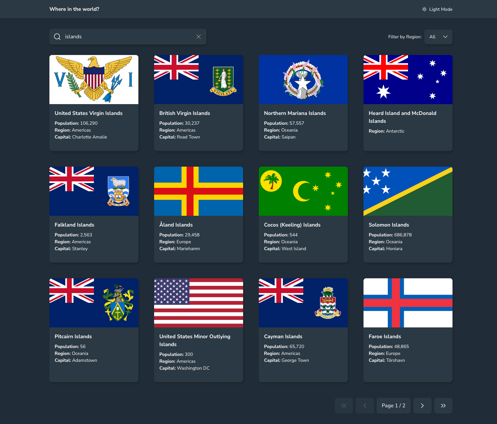
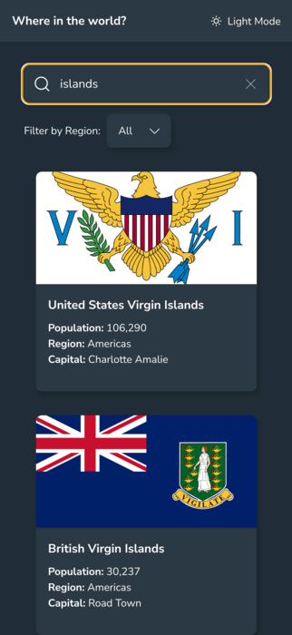
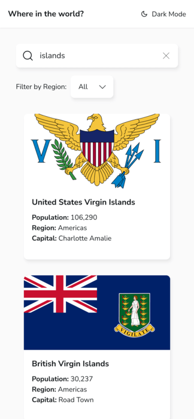
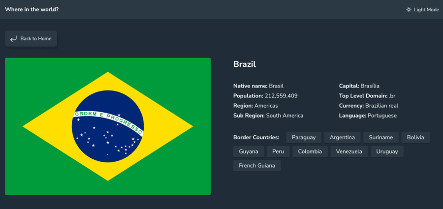
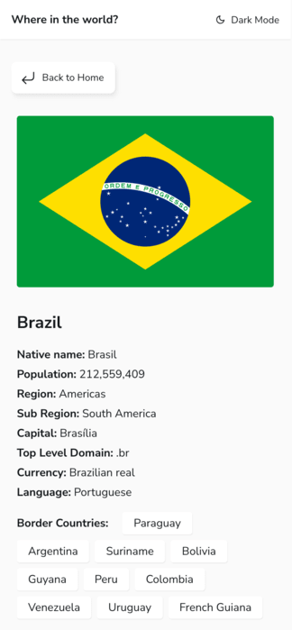

# Countries React App

An app that allows the user to find a country and peruse over its details.

This is a solution to a [Frontend Mentor challenge](https://www.frontendmentor.io/challenges/rest-countries-api-with-color-theme-switcher-5cacc469fec04111f7b848ca), which was prompted by a push to apply some recently learned React knowledge in a semi-unguided way from the [Joy of React course](https://www.joyofreact.com/).

## Table of Contents

- [Overview](#overview)
  - [The challenge](#the-challenge)
  - [Screenshot](#screenshot)
  - [Links](#links)
- [My process](#my-process)
  - [Built with](#built-with)
  - [What I learned](#what-i-learned)
  - [Continued development](#continued-development)
  - [Useful resources](#useful-resources)
- [Author](#author)
- [Acknowledgments](#acknowledgments)

## Overview

### The challenge

Users should be able to:

- See all countries from the API on the homepage using an API
- Search for a country using an `input` field
- Filter countries by region
- Click on a country to see more detailed information on a separate page
- Click through to the border countries on the detail page
- Toggle the color scheme between light and dark mode
- (Extra) Navigate through paginated results
- (Extra) See all countries on the homepage even if the API request fails

### Screenshot

  
👇 More screenshots

### Links

- Live site URL: <a href="https://fabulous-dodol-b93b05.netlify.app/" target="_blank" rel="noopener noreferrer">Here</a>

### Built with

- Semantic HTML5 markup
- CSS custom properties (variables)
- Flexbox and CSS Grid
- [React](https://reactjs.org/) - JS library
- [Styled Components](https://styled-components.com/) - For styles

### What I learned

I gained some practise with:

- Project initialisation. Setting up a project ready to start coding (e.g. installing packages, adding configuration files, adding boilerplate files necessary for a working React app).

- Project organisation. Organising files in a sensible way for a JS app, including separate files for constants, helpers, etc.

- Applying some fundamental/intermediate React concepts; using React hooks, dealing with forms, using props to pass data, using effects and correctly applying cleanup functions where appropriate, fetching data, memoising a function (a computed value), prop delegation, using context, and creating custom hooks.

- Trying/failing to think about component design. So, when and how to design/develop a component so that they're not too bloated with logic and styles.

- Using Styled Components. Taking advantage of its `ThemeProvider` to easily access a theme object within the CSS, which makes things a lot easier (no imports necessary!).

- Dealing with small CSS challenges. Something like getting a flag image to fill a certain part of a card, while having the card fill up the remaining space was a challenge.

- Being accessibility-aware. For example, ensuring certain elements are buttons, or wrapped in buttons, to help improve the experience for keyboard users. Use visually hidden elements to help describe certain elements, to help those who use screen-readers.

- Light/dark mode.

- Pagination.

- Adding a timeout to a fetch request.

### Continued development

Some thoughts:

1. Add another form input that allows the user to sort by country name or population.

2. Make the app more accessible. Use media queries like `prefers-reduced-motion` and `prefers-color-scheme`. Use `<VisuallyHidden>` where appropriate. Disabled buttons could be improved.

3. The shadow and lifting effect doesn't work so well in dark mode, so consider a different approach, probably one that uses colour in some way.

4. Various bits to the CSS could be improved. Fluid gaps definitely. Could spend more time improving animations. The CSS variables could probably be organised better in places.

5. Continue to think about ways in which the components could be designed better. For example `MainContent` is fairly bloated, and contains a lot of state that it passes along as props. Could the search form state be held in context? Could that and other components be broken down further?

### Useful resources

- [Feather Icons](https://feathericons.com/)
- [Favicons](https://favicon.io/)

### Author

- Github - [shisinbin](https://github.com/shisinbin)
- Frontend Mentor - [shisinbin](https://www.frontendmentor.io/profile/shisinbin)

### Acknowledgments

- [Josh W Comeau Courses](https://courses.joshwcomeau.com/)
- [Frontend Mentor](https://www.frontendmentor.io/)
- [Rest Countries API](https://restcountries.com/)

  <a href="#top">Back to top</a>

